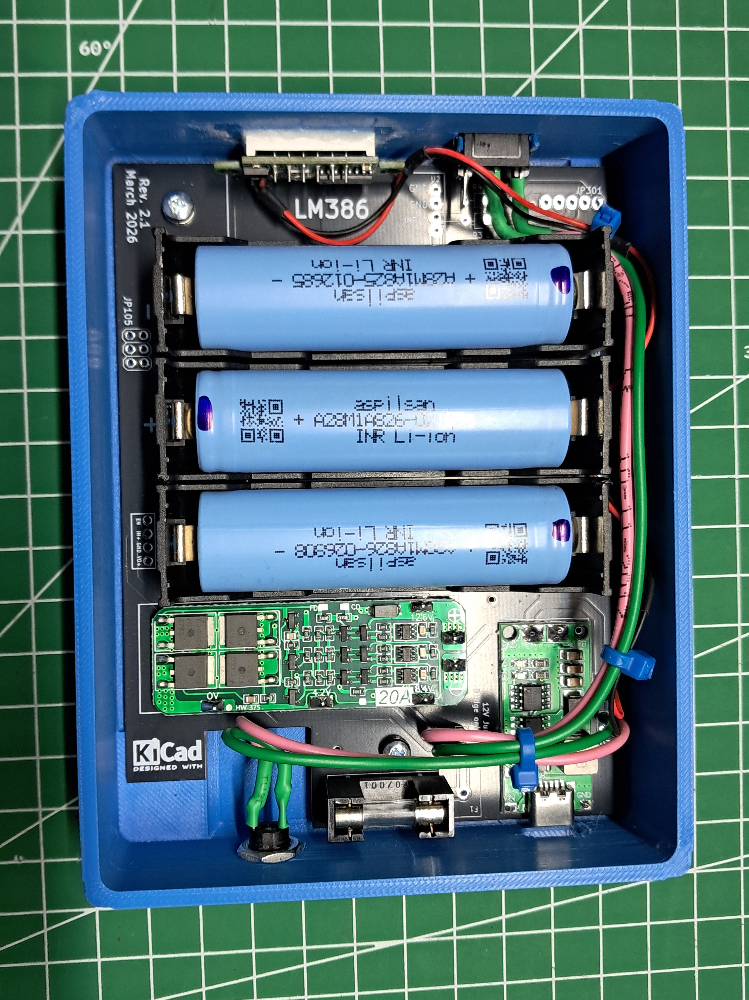

# Universal 12V Powerbank Designed around QMX+ Battery and Audio Shield & Usage Example

.png)

> A highly adaptable, 12V portable power bank system designed to supply power to various 12V transceivers and electronic devices.

This project is a hardware spin-off utilizing the printed circuit board from the [QMX+ Battery and Audio Board Rev.2](https://github.com/laxdronum/QMX-Plus-Battery-and-Audio-Board-Rev.2) project. By selectively populating only the power management components, it functions as a universal 3S 18650 Li-ion power source featuring modern Type-C charging.

---

## Device Overview

Below are the front, diagonal, and rear views of the assembled power bank unit.

.jpg)
.jpg)
.jpg)

## The SOTA/POTA Go-Bag Implementation

While engineered as a universal 12V power bank, this system pairs exceptionally well with the QRP Labs QDX digital transceiver. During field testing, it was discovered that the power supply, the QDX, and all necessary cables fit perfectly inside a Decathlon Solognac mini pouch. 

This specific configuration creates an ultra-compact, grab-and-go field kit ideal for Summits on the Air (SOTA) and Parks on the Air (POTA) operations.

## Key Features

*   **Universal 12V Output:** Standard 5.5mm DC barrel jack provides direct power for 12V transceivers.
*   **Modern Charging:** Integrated Type-C input for convenient recharging.
*   **Voltage Monitoring:** Built-in 0.28" digital voltmeter to track battery capacity during field use.
*   **Compact Form Factor:** Measuring 135mm (L) x 105mm (W) x 36mm (H), it is designed to stack efficiently with compact transceivers (like the QDX) inside minimal footprint pouches.

---

## Hardware & Internals

This build utilizes the barebones PCB of the original QMX+ Battery Board. 

**Note:** For comprehensive board assembly steps, please review the `ASSEMBLY.md` file in the [Main QMX+ Battery Board Repository](https://github.com/laxdronum/QMX-Plus-Battery-and-Audio-Board-Rev.2). The main repository also contains the detailed schematics and the **Gerber files** required for manufacturing.

### Populated Components
*   3x 18650 Battery holders (I'm using 2800mAh cells)
*   3S 20A BMS
*   Type-C Charging Module (DDTCCRUB)
*   3A Glass fuse and dedicated fuse holder
*   KCD-11 Main power switch
*   0.28" Mini digital voltmeter
*   5.5mm DC female jack

### Build & Wiring Notes
*   **Module Mounting:** All modules (such as the BMS and Type-C board) must be soldered onto male pin headers.
*   **Component Omission:** The LM386 audio amplifier and its associated components from the original QMX+ board are **not** populated in this build.
*   **Power Switch:** The KCD-11 switch directly cuts the main power. It is soldered directly to the 12V jumper location on the PCB.
*   **Outputs & Monitoring:** The voltmeter (with its VCC and Signal wires tied together) and the 5.5mm DC jack can be soldered directly to the `JP101` (+ and -) terminals. 
*   **Alternative Soldering Point:** Soldering two separate wires to the single `JP101` + and - terminals can be cramped and difficult. For an easier build, you can solder the second set of wires to the capacitor pad and its corresponding THT hole located immediately next to `JP101`. These points are wired in parallel with the `JP101` terminals (easily verified by following the PCB traces).

---

## 3D Printing & Assembly

The custom enclosure was designed from scratch using **FreeCAD**. Two STL files are provided for the enclosure: one for the main body and one for the snap-on lid.

**Enclosure Features:**
*   **Physical Dimensions:** 135mm Length x 105mm Width x 36mm Height.
*   **Snap-Fit Design:** The lid securely snaps into place on the main body without requiring extra hardware.
*   **PCB Mounting:** The PCB is secured inside the main body using **two M3x5mm screws**.
*   **Clean Design:** *Note that the enclosures shown in the project photos feature custom text and logos for personal aesthetic preferences. The STL files provided in this repository are completely clean and blank.*

**Material Recommendations:**
While the enclosure can be printed in **PLA** or **PETG** for general use, I've used **ABS** for the final build for maximum physical durability and thermal resistance during outdoor field operations.